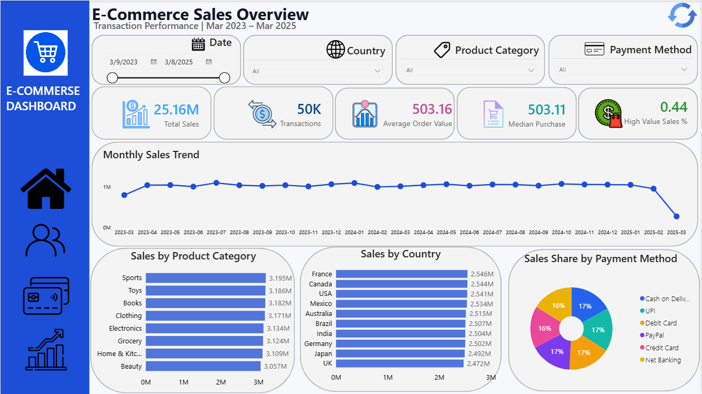
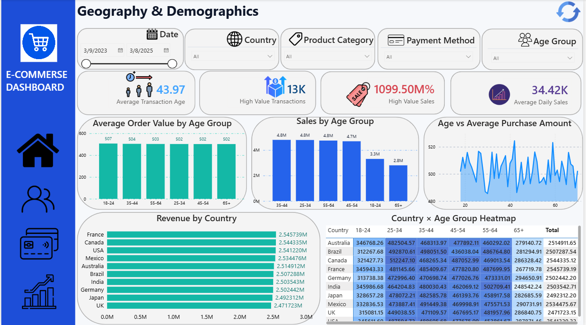
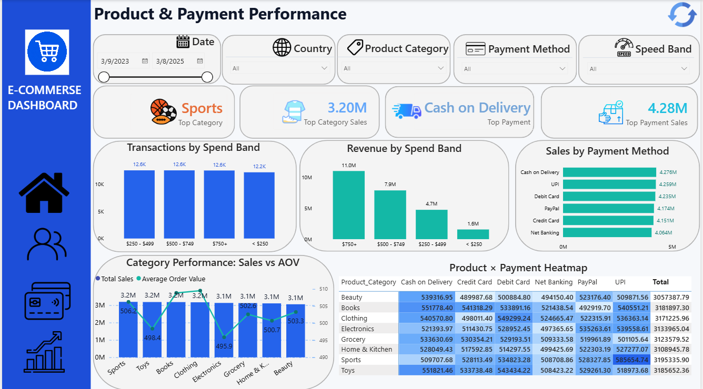
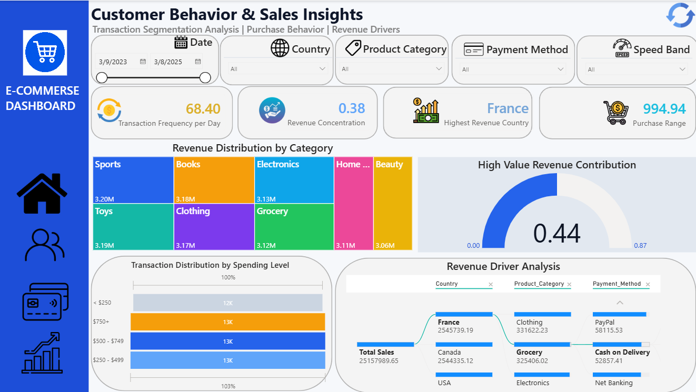

# Ecommerse-Sales-Analysis-PowerBI-Dashboard
Interactive Power BI dashboard analyzing e-commerce transactions, sales performance, customer behavior, product categories, payment methods, and revenue drivers.


# 🛒 E-Commerce Sales Analysis — Power BI Dashboard

An interactive **Power BI E-Commerce Sales Analytics Dashboard** developed to analyze transaction performance, customer purchasing behavior, product category performance, payment methods, geographic sales distribution, and revenue drivers.

The project transforms raw e-commerce transaction data into actionable business insights using DAX measures, KPI cards, segmentation analysis, and interactive visualizations.

---

# 🔍 Analysis Key

This dashboard was designed to answer key e-commerce business questions:

* What is the overall sales performance?
* Which countries generate the highest revenue?
* Which product categories contribute the most sales?
* Which payment methods are preferred by customers?
* What are the main revenue drivers?
* How does customer age affect purchasing behavior?
* Which customer segments generate high-value transactions?
* What is the average order value?
* How frequently do customers purchase products?
* Which categories and products perform best?
* How does spending behavior differ between customer groups?

---

# 🗝 Key Concepts Used

## 📊 Data Cleaning & Transformation

* Preparing raw transaction data for analysis
* Cleaning and formatting transaction fields
* Creating analytical categories:

  * Age Groups
  * Spend Bands
  * High Value Transactions
* Preparing data types for Power BI analysis

---

## 🔗 Data Modeling

* Building a structured Power BI data model
* Creating relationships between transaction attributes
* Preparing data for interactive reporting

---

## 🧮 DAX Measures

Created analytical measures including:

* Total Sales
* Total Transactions
* Average Order Value (AOV)
* Median Purchase Amount
* High Value Sales %
* Transaction Frequency
* Revenue Concentration
* Average Daily Sales
* Purchase Range

---

## 👥 Customer Behavior Analysis

Analyzed customer purchasing patterns using:

* Age Group Analysis
* Transaction Frequency
* Average Order Value
* High Value Customers
* Revenue Contribution

---

## 🛍 Product Performance Analysis

Analyzed:

* Product Categories
* Top Revenue Categories
* Category Sales Contribution
* Product Performance
* Sales vs AOV Relationship

Main categories:

* Sports
* Books
* Electronics
* Home & Kitchen
* Beauty
* Clothing
* Grocery
* Toys

---

## 💳 Payment Method Analysis

Compared customer payment preferences:

* Cash on Delivery
* UPI
* Debit Card
* Credit Card
* PayPal
* Net Banking

---

## 🌍 Geographic Analysis

Analyzed revenue performance by:

* Country
* Customer location
* Regional contribution

---

## 🎨 Data Visualization

Dashboard visuals include:

* KPI Cards
* Treemap
* Donut Charts
* Bar Charts
* Line Charts
* Heatmaps
* Decomposition Tree
* Tables
* Interactive Slicers

---

# 📊 Outputs

# 📌 Page 1 — E-Commerce Sales Overview

**Transaction Performance | Mar 2023 – Mar 2025**

This page provides a complete overview of e-commerce sales performance.

### KPI Overview

Main indicators:

* **Total Sales:** 25.16M
* **Transactions:** 50K
* **Average Order Value:** 503.16
* **Median Purchase:** 503.11
* **High Value Sales %:** 0.44

### Visual Analysis:

### 📈 Monthly Sales Trend

Shows sales performance changes from March 2023 to March 2025.

### 🛒 Sales by Product Category

Analyzes category contribution to total revenue.

### 🌎 Sales by Country

Shows countries generating the highest revenue.

### 💳 Sales Share by Payment Method

Compares customer payment preferences.



---

# 📌 Page 2 — Customer Behavior & Sales Insights

**Transaction Segmentation Analysis | Purchase Behavior | Revenue Drivers**

This page focuses on customer purchasing behavior and revenue generation factors.

### KPI Overview:

* Transaction Frequency per Day
* Revenue Concentration
* Highest Revenue Country
* Purchase Range

### Visual Analysis:

### 👥 Revenue Distribution by Category

Analyzes how revenue is distributed across product categories.

### 💰 High Value Revenue Contribution

Shows contribution from high-value transactions.

### 📊 Spending Level Analysis

Segments transactions by:

* < $250
* $250–$499
* $500–$749
* $750+

### 🌍 Revenue Driver Analysis

Identifies key revenue contributors by:

* Country
* Product Category
* Payment Method



---

# 📌 Page 3 — Product & Payment Performance

This page analyzes product category performance and payment behavior.

### Main Analysis:

* Top Category
* Top Category Sales
* Top Payment Method
* Top Payment Sales

### Visuals:

* Transactions by Spend Band
* Revenue by Spend Band
* Sales by Payment Method
* Category Performance: Sales vs AOV
* Product × Payment Heatmap



---

# 📌 Page 4 — Geography & Demographics

This page analyzes customer demographics and geographical revenue patterns.

### KPI Overview:

* Average Transaction Age
* High Value Transactions
* High Value Sales
* Average Daily Sales

### Visuals:

* Average Order Value by Age Group
* Sales by Age Group
* Age vs Average Purchase Amount
* Revenue by Country
* Country × Age Group Heatmap



---

# 📌 Dataset Summary

| Metric              |  Value |
| ------------------- | -----: |
| Records             | 50,000 |
| Total Sales         | 25.16M |
| Average Order Value | 503.16 |
| Median Purchase     | 503.11 |
| Countries           |     10 |
| Product Categories  |      8 |
| Payment Methods     |      6 |

Dataset includes:

* Transaction details
* Customer information
* Product categories
* Purchase amounts
* Payment methods
* Country information
* Age groups

---

# 🚀 How to Run

## Requirements

* Microsoft Power BI Desktop
* CSV Dataset

## Steps

1. Clone this repository:

```bash
git clone <your-repository-url>
```

2. Open:

```text
E-Commerse(1).pbix
```

with Microsoft Power BI Desktop.

3. Make sure the dataset exists:

```text
ecommerce_transactions(2).csv
```

4. If Power BI cannot locate the dataset:

```text
Power BI
→ Transform Data
→ Data Source Settings
→ Change Source
```

5. Select the CSV file.

6. Click **Refresh**.

7. Use filters and slicers to explore different business scenarios.

---

# 📁 Repository Structure

```text
ecommerce-sales-analysis-powerbi-dashboard/

│
├── E-Commerse(1).pbix
├── ecommerce_transactions(2).csv
├── README.md
│
└── images/
    ├── page1.png
    ├── page2.png
    ├── page3.png
    └── page4.png
```

---

# 📝 Notes

* This project was created for data analytics and portfolio purposes.
* The dataset contains 50,000 e-commerce transactions.
* All insights are generated using Power BI calculations and visualizations.
* The dashboard demonstrates sales analysis, customer segmentation, and revenue driver analysis.
* Power BI `.pbix` files cannot be previewed directly on GitHub, therefore screenshots are included.

---

# 👤 About Me
📩 Contact: [govharorucova@outlook.com] 🌐 GitHub: [https://github.com/GovharOrujova]

[https://www.linkedin.com/in/govhar-orujova-64333b369/]

---


